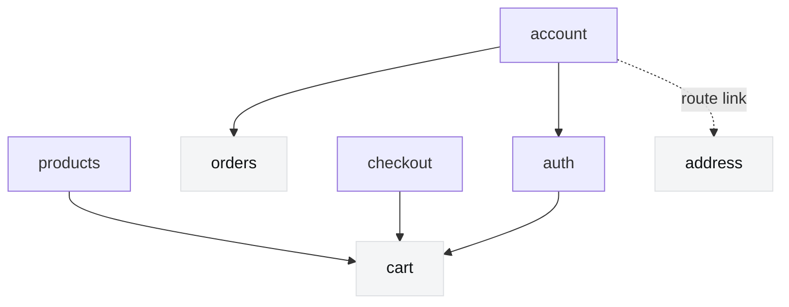

# 20. The Store's Feature Graph Is Acyclic and Enforced

**Status:** Accepted

## Context

`apps/store/src/features/` holds seven features, and nothing has ever constrained which of them
may import which. The rules in `deps-analyzer/.dependency-cruiser.cjs` were `no-admin-schemas-in-store`
and `no-circular`; neither says anything about feature boundaries.

In practice six cross-feature edges had accumulated, and one pair pointed both ways:

- `cart/components/cart-content.tsx` → `checkout/constants.ts`
- `checkout/api/checkout.ts` → `cart/api/cart.ts`

`no-circular` passed anyway, because it works on **modules** and those are two different modules
in each feature — nothing ever reached itself. The cycle only existed once you collapsed modules
into features, which no rule looked at.

That latent cycle was not harmless. Introducing a per-feature `index.ts` barrel — the usual way to
stop one feature reaching into another's internals — would have converted it into a real module
cycle (`cart/index.ts → cart-content.tsx → checkout/index.ts → checkout/api.ts → cart/index.ts`)
and broken `no-circular`. A latent design problem was one refactor away from becoming a build
failure, and nothing surfaced it in the meantime.

The `cart → checkout` edge was also wrong on its own terms. Its entire content was the cart's
"Go to checkout" button choosing which step checkout should open on:

```tsx
<Link to="/checkout" search={{ step: isGuest() ? Step.CONTACT : Step.ADDRESS }} />
```

`useCheckoutProgress` already computed that exact expression as `defaultStep` — and that export
was dead, consumed nowhere. The rule had leaked upstream into the cart and checkout's own copy had
withered.

## Decision

**Store features form a declared directed acyclic graph, and dependency-cruiser enforces it.**



Read a **solid** arrow as "may import from". A feature may import from the features it points to
and from nothing else under `features/`; the shared layers (`#/components`, `#/lib`, `#/api`,
`#/env`) are always available to everyone.

The **dotted** arrow is not a dependency and is not enforced. The account dashboard reaches the
address book the way a shopper does — `<Panel render={<Link to="/account/addresses" />} />` — so
the two features are composed by the route tree, not by an import. It is drawn because a feature
with no arrows at all reads as an oversight, and because the distinction is the point: navigation
between features is free, importing between them is not.

| Feature | May import | Why |
|---|---|---|
| `cart` | — | The bag exists without anything else. Leaf. |
| `orders` | — | Reads `/store/orders`; owes nothing to the rest. Leaf. |
| `address` | — | Saved addresses stand alone; the account page only links to them. Leaf. |
| `products` | `cart` | `AddToCart` lives with the PDP that renders it and calls the cart's `api`. |
| `checkout` | `cart` | Checkout turns a cart into an order. |
| `auth` | `cart` | Signing in transfers the guest cart. |
| `account` | `auth`, `orders` | The dashboard composes them. `address` is reached by route link rather than import, so it is deliberately not declared — add it the day the dashboard actually renders address data. |

The direction follows the domain, and that is what makes it stable: a cart is meaningful with no
checkout, so `checkout → cart` and never the reverse.

When two features genuinely need the same thing, the answer is not an edge between them — it is
that the thing was never feature-specific. Move it down to a shared layer. `AccountPanel` became
`#/components/panel.tsx` for exactly this reason, so the address book could use it without
`address → account`.

When one feature wants to make a decision another feature owns, invert it. The cart now links to
`/checkout` with no search param, and `CheckoutContent` — which already mapped an authenticated
shopper off the contact step — is the only place that decision is made. `defaultStep` was deleted
rather than revived: it was the second of three copies of one rule.

## Enforcement

`.dependency-cruiser.cjs` derives one rule per feature from a single `FEATURE_GRAPH` literal, so
the table above and the rules cannot drift: a feature may reach itself and its declared
dependencies, and any other `features/` path is an error. `no-circular` stays, and now guards the
module level while `FEATURE_GRAPH` guards the feature level.

A new feature is a new key in that object. Leaving it out is not a loophole — an undeclared
feature is allowed to import nothing, so the first cross-feature import fails the gate and forces
the graph to be updated deliberately.

## Consequences

- The graph is a DAG, so a per-feature `index.ts` barrel can be introduced later without tripping
  `no-circular`. That is a separate decision and is not taken here.
- Adding an edge is a deliberate act: you edit `FEATURE_GRAPH` and this ADR, or you move the
  shared thing down a layer instead. The default answer to "these two features need each other"
  is now "one of them is wrong".
- The entry-step rule existed in three places (the cart's link, `useCheckoutProgress.defaultStep`,
  and `CheckoutContent.effectiveStep`), two of which were redundant and one dead. Only
  `effectiveStep` remains.
- `step` is now optional in the checkout route's search schema, so `/checkout` is a valid link on
  its own.
- The rules constrain `features/` only. Routes under `src/routes/` compose whatever they need, as
  they must.

## References

- `apps/store/deps-analyzer/.dependency-cruiser.cjs` — `FEATURE_GRAPH` and the generated rules
- ADR 0005 — the same instinct on the backend: public contracts in `core/types/` to prevent
  circular imports
