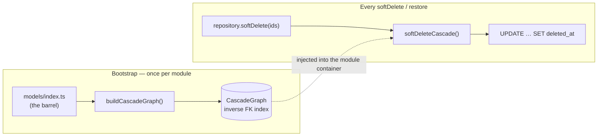
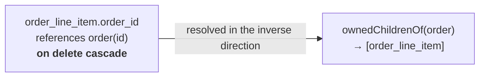
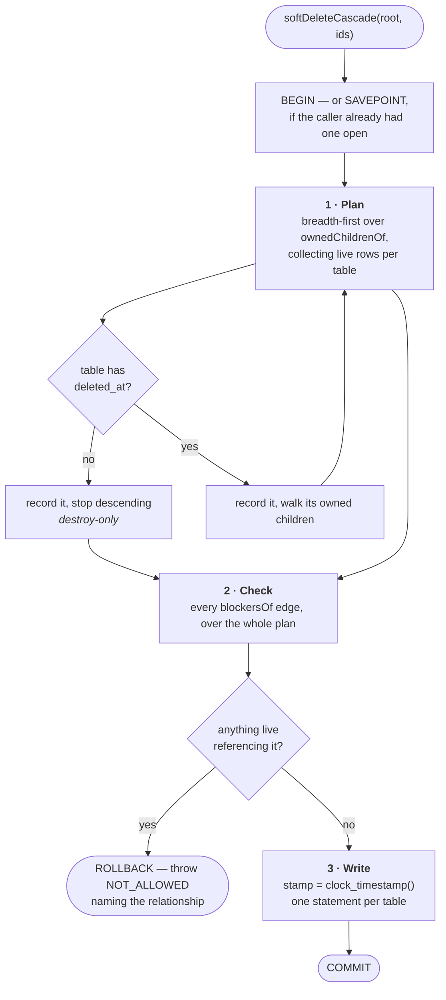
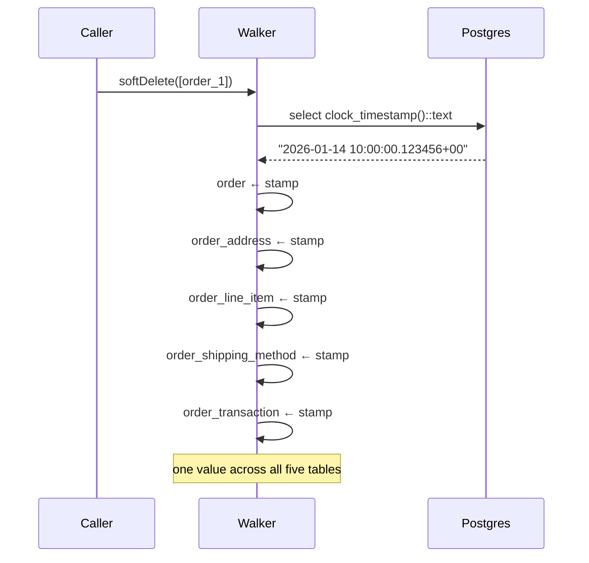
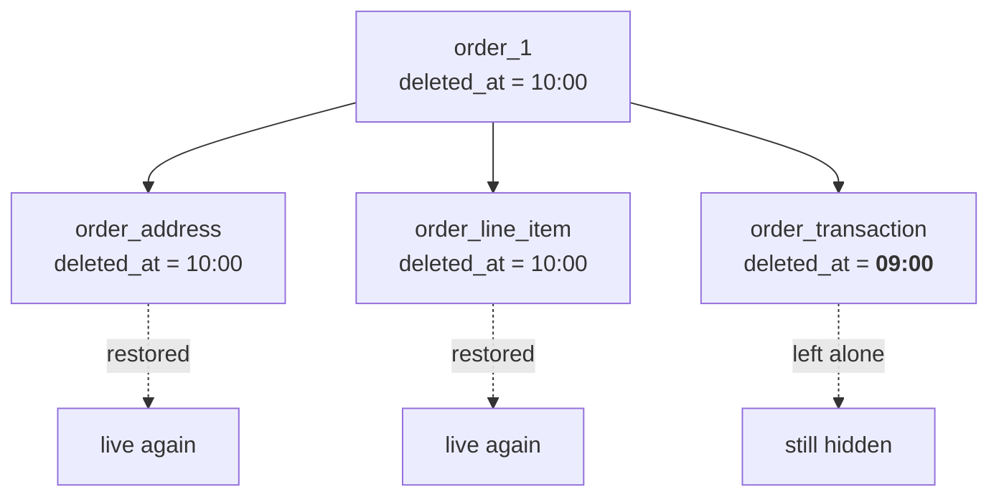
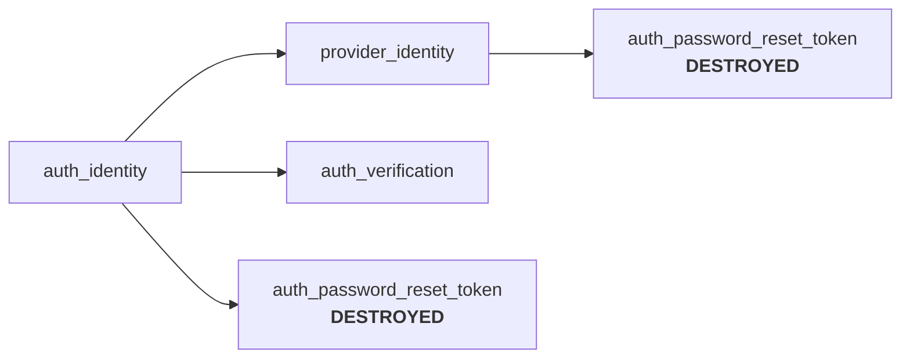
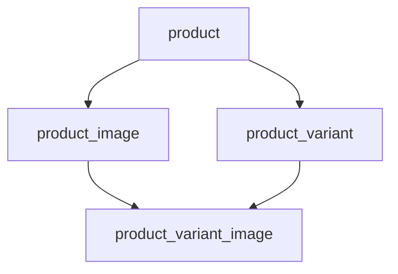
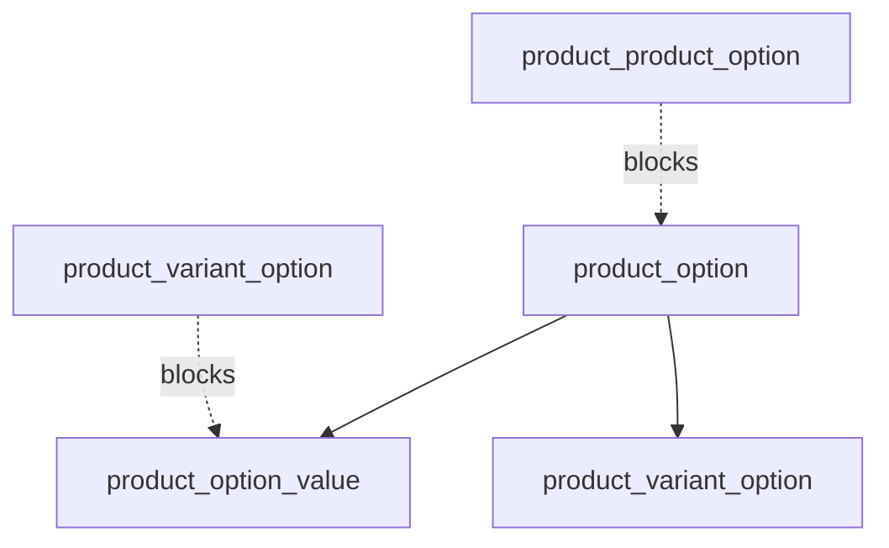
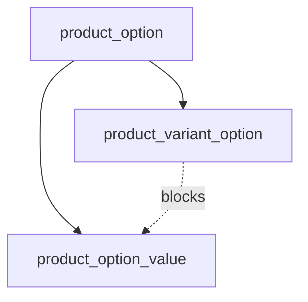

# Soft-Delete Cascade

Soft-deleting a record hides the children the schema already says it owns. Nothing declares that
list twice: it is derived from the foreign keys, so a new child table is covered the moment it
declares its relationship.

This is the *how*. For the *why* — and why the cascade is derived rather than declared per
service — read [ADR 0016](adr/0016-derived-soft-delete-cascade.md).

## Vocabulary

Six words the rest of this page leans on. They name shapes in the *schema*, not types in the code.

| Term | Means |
| --- | --- |
| **Owner** | A table whose deletion other rows follow. `order` owns its line items |
| **Owned child** | A table that declares `on delete cascade` to an owner. It is hidden by the same event |
| **Guard** | A table whose `on delete restrict` reference refuses another table's deletion. `product_product_option` guards `product_option` |
| **Guarded table** | The table a guard points at — the one that cannot go while a live guard row cites it |
| **Cascade closure** | Every table one deletion reaches by following `on delete cascade` from a root, the root included |
| **Overlap** | A closure holding both a guard and the table it guards. Legal, answered consistently, and worth noticing — see [Overlap](#overlap--a-guard-inside-its-own-closure) |

## The two pieces



| | File | Runs |
| --- | --- | --- |
| **Graph** | `src/core/db/cascade-graph.ts` | Once per module, at bootstrap |
| **Walker** | `src/core/db/cascade-walker.ts` | On every `softDelete` and `restore` |

The graph is scoped to one module's models. No foreign key crosses a module boundary, so a
module-scoped graph is complete — and a global one would cost the isolation the two-container
bootstrap buys.

## Step 1 — deriving the graph

A foreign key already states what happens to the child when the parent goes. The graph reads those
declarations and **inverts them**: the child declares the relationship, but the walker needs to ask
the *parent* what it owns.



Only two on-delete actions produce an edge:

| Declaration | Goes into | What the walker does |
| --- | --- | --- |
| `on delete cascade` | `ownedChildrenOf(parent)` | Travels to the child and hides it |
| `on delete restrict` | `blockersOf(parent)` | Refuses the deletion while a live child references it |
| anything else (`set null`, undeclared) | — | Ignored. Says nothing about ownership |

Every edge names one column on each side, because the walker matches one column against a set of
parent ids. A **composite foreign key** still produces an edge, followed through whichever of its
columns is paired with the parent's primary key — the rest narrow the match further, and leaving
them to the database costs nothing a soft delete can observe. A reference where **none** of the
referenced columns is a primary key, or **more than one** is, throws when the module boots: ids are
what the walker collects, and nothing in the second case says which column to travel.

> Lookups are keyed by **table name, not object identity**, so a caller passing a table imported
> from anywhere still resolves.

## Step 2 — walking the delete

A delete happens in three phases, and never interleaves them: **plan** everything it would touch,
**check** every restrict edge against that pre-cascade state, then **write**. All three share one
transaction.



Why the phases are separate is the whole point:

- **Checking before writing is what makes the answer deterministic.** A restrict check run halfway
  through the hiding reads a table the same cascade has already emptied — so whether it finds a
  live guard depends on which edge the traversal reached first, which is barrel export order.
- **One transaction is what makes a refusal mean nothing happened.** A refusal raised two hops down
  used to leave the root and everything above it already hidden.
- **A guard the same cascade would itself hide still blocks**, because every check reads the state
  the caller asked about. See [Overlap](#overlap--a-guard-inside-its-own-closure).

Three details in the loop carry real weight:

- **`WHERE deleted_at IS NULL` on the write.** The plan was read earlier in the transaction, and
  under `READ COMMITTED` another transaction can commit a deletion in between. A row hidden that
  way keeps the timestamp it was hidden with.
- **The restrict check covers every table in the plan**, not only the root, so it cannot be reached
  around.
- **Tables are written directly, not through repositories**, because coverage must not depend on
  which tables happened to get one.

### Opening a transaction is always safe

The walker opens one whether it was handed the pool or a transaction a caller already had open.
drizzle-postgres-js issues a nested transaction as `SAVEPOINT` / `ROLLBACK TO` — verified, not
assumed: a refusal inside a caller's transaction discards only the walker's own writes, and the
caller's transaction goes on to commit.

That is what lets the callers which reach a repository without a transaction — workflow
compensation steps, `link-service.dismissLinks`, two `payment-module-service` methods — stay
exactly as they are.

### How large a cascade can get

Planning before writing means each table is written once with every id it owes, rather than in
per-frontier batches. The bound is Postgres's bind-parameter cap: an `IN`-list of 100,000 ids fails
with `Max number of parameters (65534) exceeded`, so **roughly 65,000 rows per table** is the
ceiling for one cascade. No path comes close. If a bulk or purge path ever appears, `= ANY(array)`
passes the whole list as a single parameter and lifts the limit.

## Step 3 — one timestamp makes it an *event*

Every table the cascade touches is stamped with the **same** `deletedAt` value. That value is the
event's identity, and it is what restore matches on.



**The stamp comes from the database, and stays text the whole way.** Two rules hold it there:

- **`clock_timestamp()`, not `now()`.** `now()` is the transaction's start time, so every cascade in
  one transaction would take the same value and merge into a single event.
- **Text, never a JS `Date`.** `timestamptz` carries microseconds; a `Date` carries milliseconds. A
  stamp that round-trips through `Date` comes back truncated, and `deleted_at = $1` stops matching
  the rows the same cascade just wrote. So `restoreCascade` reads `deleted_at::text`, matches with
  `deleted_at = $1::timestamptz`, and groups events on the string.

It used to be a `new Date()` taken in `BaseRepository.softDelete`. At millisecond resolution two
deletions inside one millisecond were indistinguishable, and restoring the second swept the first
back with it.

## Step 4 — restore undoes one event

`restoreCascade` reads the root's current `deletedAt`, clears it, then walks the same graph
restoring **only** children carrying that exact timestamp.



The transaction was deleted an hour earlier for its own reasons. It was never part of the 10:00
event, so undoing that event must not resurrect it.

Restoring several roots at once is handled by grouping them into events first — each group is
restored against its own timestamp. The whole restore shares one transaction, so a restore that
cannot complete leaves the rows exactly as hidden as it found them.

### When the slot has been refilled

Clearing `deleted_at` puts a row back into every partial unique index that excludes hidden rows —
every index built with `liveUniqueIndex`. If something claimed its slot while it was away, Postgres
raises an ordinary unique violation, and reported as one it reads like a bad create:

```
product: slug "blue-tee" already exists
```

That sends the reader looking for a duplicate request that never happened. `restoreErrorMapper`
tells it from the restore's point of view instead — the row coming back is the one that is late:

```
Cannot restore product: slug "blue-tee" was taken by another record while it was deleted
```

## Children with no `deleted_at`

A missing soft-delete column is a deliberate statement that the table is **destroy-only**. The
cascade declaration still applies: the row goes, it just goes for good.



`auth_password_reset_token` is the only such table today. A retained token hash *is* the threat
model, and restoring a spent credential has no legitimate meaning — so it has no column to restore
from. Note it hangs off provider identity as well as auth identity: the rule holds at any depth,
not just for direct children.

## Diamonds and cycles

A row reachable by more than one path is handled the first time it is reached and not again.



`product_variant_image` is reached twice when a product is deleted — once down through the image
it shows and once through the variant that shows it. It is hidden once, on first arrival.

## Restrict — refusing a deletion

`product` is the only module with restrict edges, and they exist to stop a shared row disappearing
underneath the things still using it.



Refusal raises `NOT_ALLOWED` (400) naming the relationship, e.g.:

```
Cannot delete from product_option: still referenced from product_product_option.option_id
```

The database raises the same shape on a hard delete, so callers handle one contract regardless of
origin.

## Overlap — a guard inside its own closure

A closure can hold both a guard and the table it guards. `product_option` is the live example: one
deletion of it reaches `product_option_value` and `product_variant_option`, and the second guards
the first.



This used to be the bug on this page. The restrict check was interleaved with the hiding, and its
"is anything live referencing this?" query excludes rows already hidden — so:

- Reach `product_option_value` first → its guard is still live → **refused**
- Reach `product_variant_option` first → it is hidden → nothing live blocks → **the value is hidden
  too**, stripping variants of their identity

Which one happened was barrel export order, and a re-ordered export list is not a change to the
schema. Both are now refused, because every check reads the pre-cascade state: a guard this same
cascade *would* hide still blocks. Pinned from both directions by
`refuse whichever of the pair the walker reaches first` in
`src/core/db/__tests__/cascade-walker.test.ts`, which runs the same fixture under two barrel
orderings.

Deterministic, but still worth noticing: an author who wrote two `cascade` edges expecting both
children to go instead gets a deletion refused whenever a guard row exists. So
`guard-outside-its-closure` **warns** — it does not fail the build, because the fix is a schema
redesign rather than a line to change. Opt out by recording the guard relationship in its `ALLOWED`
map with the reason the refusal is intended.

## Hard delete is the database's job

The walker only implements `softDelete` and `restore`. A hard delete is left entirely to Postgres,
which already acts on the same `on delete cascade` declarations — exactly one implementation of
that behaviour, and no chance of the two disagreeing.

## What CI enforces

`npm run verify` runs `scripts/checks/`, which fails the build when:

- a model is not reachable from its module's barrel — the graph is built from the barrel and
  nothing else, so an unexported model keeps its foreign keys and quietly stops being reached;
- a cascade or restrict relationship has no index leading with its column;
- an index on a soft-deletable table does not exclude soft-deleted rows, or spells the predicate
  by hand instead of using `liveIndex` / `liveUniqueIndex`;
- a table is missing the standard timestamp columns without being explicitly exempt;
- a soft-deletable table hangs off a destroy-only one — the walker stops descending after a hard
  delete, so Postgres would remove the child outright and its `deletedAt` column would be a
  promise nothing can keep.

And warns, without failing, when:

- one cascade closure contains both a guard and the table it guards.

## Where things live

| | Path |
| --- | --- |
| Graph | `apps/backend/src/core/db/cascade-graph.ts` |
| Walker | `apps/backend/src/core/db/cascade-walker.ts` |
| Shared schema facts | `apps/backend/src/core/db/utils.ts` |
| Restore-aware errors | `apps/backend/src/core/errors/db-error-mapper.ts` (`restoreErrorMapper`) |
| Entry points | `apps/backend/src/core/utils/base-repository.ts` (`softDelete`, `restore`) |
| Unit tests | `apps/backend/src/core/db/__tests__/cascade-{graph,walker}.test.ts` |
| Conventions checks | `apps/backend/scripts/checks/` |
| Decision record | `docs/adr/0016-derived-soft-delete-cascade.md` |
